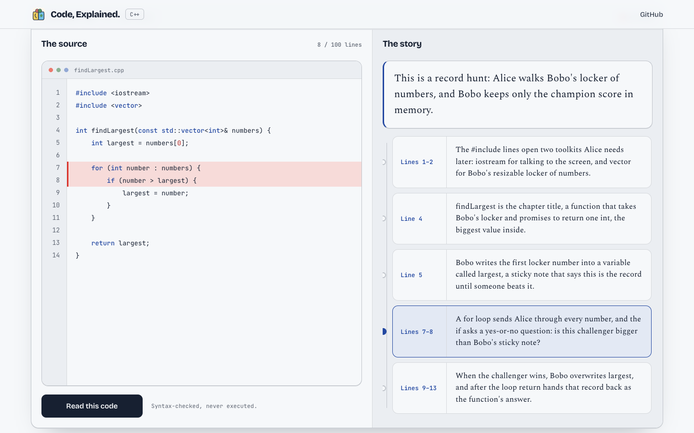

# Code, Explained.

[Open the site](https://wuisabel-gif.github.io/code-explained/)

Your code is already in your hands: lines you typed, syntax that is hard to remember without a plot. Turn your code into an interesting story, so learning it is easier.

Paste or upload any code you have: Alice is the action. Bobo is memory. Each sentence stays tied to the lines it explains. The words are plain, like a story you could read to a child.

**Why bother.** Syntax without a plot is hard to remember, and a story you can follow makes the function easier to learn.

**Why upload.** It can be any code you have. Drop the file instead of retyping it.

**OpenAI, inside the page.** A live read sends your code to the embedded OpenAI API and maps each sentence back to the source.



## Why a story helps

Code looks like marks on a page until someone tells you who is doing what. A story gives those marks a person, a job, and an ending. Computing teachers have tested that idea. This site is a small version of it: Alice does the action, Bobo holds the memory, and you click a sentence to light up the matching lines.

**You already know the picture.** New ideas stick when they hang on something you have already seen: a box, a sticky note, a cup. Oregon State’s “story programming” work teaches computer science with simple stories and games before students have to live inside the syntax. [Parham-Mocello, Ernst, Erwig, Shellhammer, and Dominguez, SIGCSE 2019](https://dl.acm.org/doi/10.1145/3287324.3287397). A later curriculum paper makes the same case for analogies and everyday scenes. [Parham-Mocello, Erwig, and Niess, SIGCSE 2024](https://dl.acm.org/doi/10.1145/3626252.3630777).

**You stay with it longer.** When programming is a way to tell a story, people keep going. Middle-school girls using Storytelling Alice were three times more likely to keep working after time was called. [Kelleher and Pausch, Communications of the ACM, 2007](https://dl.acm.org/doi/10.1145/1272516.1272540).

**A hard idea is easier on the first look.** In a 2024 University of Toronto study, 138 students who watched storytelling videos about an abstract computing idea scored higher on the first quiz than 138 students who watched ordinary lecture videos, without spending more time. That gain did not automatically show up on a second, different task. A story is a door in, not a whole course. [Singh, Zhu, and Petersen, SIGCSE 2024](https://dl.acm.org/doi/10.1145/3649405.3659499).

**Saying the next line out loud is the work.** When you map one English sentence to one or two lines of code, you are doing what psychologists call self-explanation: putting the next step into your own words. That improves understanding. [Chi, de Leeuw, Chiu, and LaVancher, Cognitive Science, 1994](https://onlinelibrary.wiley.com/doi/abs/10.1207/s15516709cog1803_3). Teachers who ask students to “tell the story of the code” use that same move to find bugs. [Dey, Powell, and Eijkhout, Journal of Computational Science Education](https://jocse.org/downloads/jocse-16-2-2.pdf).

**Young children already learn computing this way.** StoryCoder taught sequences, loops, events, and variables to 5- to 8-year-olds through stories they could hear and change. [Dietz et al., CHI 2021](https://dl.acm.org/doi/10.1145/3411764.3445039).

## The words it produces

**Example 1**

```cpp
int findLargest(const std::vector<int>& numbers) {
    int largest = numbers[0];
    for (int number : numbers) {
        if (number > largest) {
            largest = number;
        }
    }
    return largest;
}
```

> Alice looks in Bobo's box of numbers, and Bobo keeps the biggest one.

`for` means Alice looks at every number, and `if` asks: is this one bigger than Bobo's sticky note?

**Example 2**

```python
def swap_values(alice, bobo):
    cup = alice
    alice = bobo
    bobo = cup
    return alice, bobo
```

> Alice and Bobo trade numbers, and they use a cup so nobody drops theirs.

**Example 3**

```javascript
function winner(alice, bobo) {
    if (alice > bobo) {
        return alice;
    }
    return bobo;
}
```

> Alice and Bobo compare scores, and the bigger number wins.

## License

© 2026 Isabel Wu. [MIT License](LICENSE).

For local development instructions, see [CONTRIBUTING.md](CONTRIBUTING.md).
